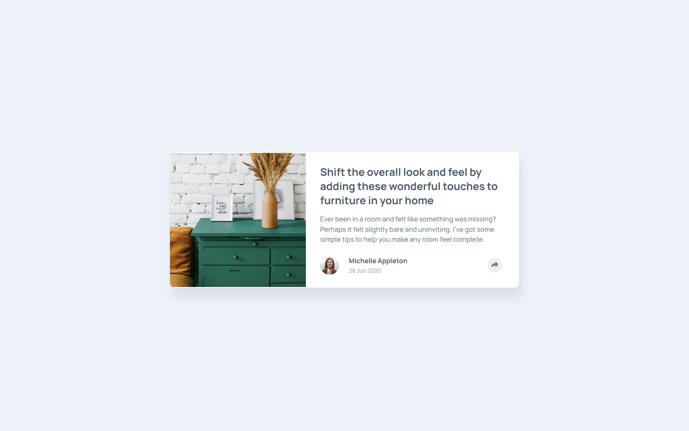

# Frontend Mentor - Article preview component solution

This is a solution to the [Article preview component challenge on Frontend Mentor](https://www.frontendmentor.io/challenges/article-preview-component-dYBN_pYFT). Frontend Mentor challenges help you improve your coding skills by building realistic projects. 

### The challenge

Users should be able to:

- View the optimal layout for the component depending on their device's screen size
- See the social media share links when they click the share icon

### Screenshot

## My process

### Built with

- HTML5 
- CSS 
- Flexbox
- Mobile-first workflow

### What I learned

I learned about layers. Still learning a lot about positioning and a bit more JavaScript. My biggest difficulty was in positioning and displaying the "share-container" and I couldn't do the inverted triangle.

